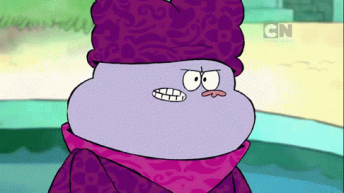

# 20_BALLS
BALLS are logistical lighting spheres

BALLS is a smart juggling balls platform that will function to both give feedback to the juggler about thier technique(training mode) and will also provide an immersive experience to the audience(performance mode)
### Overview
Information about how the juggler is throwing the balls will be gathered using a camera located on a raspberry pi via OpenCV blob detection. This information will be used to decide which color to make the LEDs on each ball light up to which will be sent to radio modules on the balls. 

### Training Mode Ideas
* **Pattern correctness training:** Balls will light up in a gradient between two colors which will be decided based on how uniformly the balls are being juggled. A sloppy and uneven pattern will result in the balls being closer to one side of the gradient, while an evenly spaced pattern will make the balls light up closer to the other side.
* **Height correctness training:** Balls light up at a certain set hieght that the juggler is trying to ideally throw all the balls to peak at. If the ball doesn't light up it isn't being thrown high enough, if it lights up before the peak it is being thrown too high.
* **Juggling without looking training:** To be done in a pitch black or mostly dark room. Balls light up for a period of thier arc before cutting to black and requiring the juggler to catch them without using their eyes. Light up period can be gradually reduced until the juggler is catching and throwing the balls without using their eyes at all.

### Performance Mode Ideas
* **Left-Right lighting:** Balls thrown left to right light up one color, balls thrown right to left light up another color.
* **Gradient lighting:** Balls light up in a gradient between two colors based on some characteristic about their flight path. Ex. ball height, ball speed, ball location(left to right), etc.
* **Color array lighting:** Each location in the frame of the camera corresponds to a different color. As balls pass through a location, they light up to that color. Imagine this with [circle juggling](https://www.libraryofjuggling.com/Tricks/3balltricks/Shower.html) where if done fast enough the balls would form a colorful circle.
An example of what this might look like is something like how the textures of clothing is animated on the Cartoon Network show *Chowder* as you can see here:

* **Color array lighting++:** Same as color array lighting but the color array rotates.
